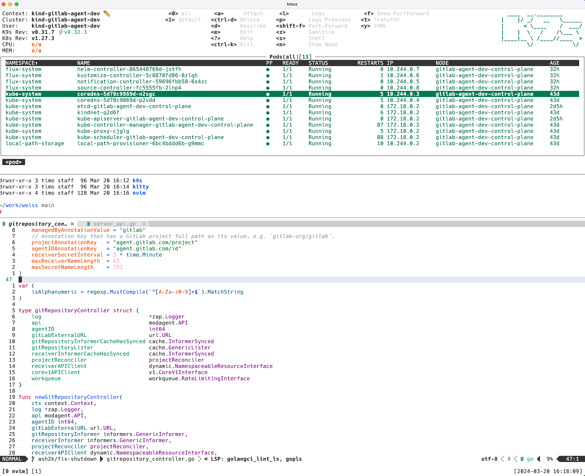

# weiss

**weiss**. A de**light**ful color scheme for my personal terminal stack.

> 🚧 This is **work in progress**. You probably don't want to use this at the moment.
> There are lots of sharp edges everywhere. Kinda like a sharks mouth. Be careful.

